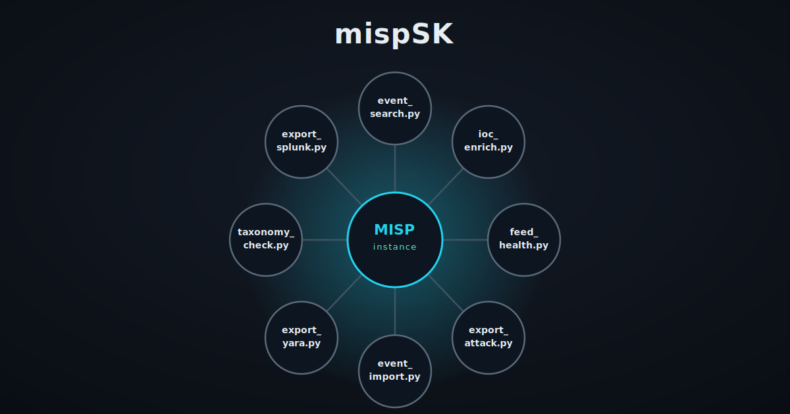

# mispSK - MISP Script Kit

A collection of Python scripts automating operations on MISP instances (via PyMISP).

---

## Scripts


 
| Script | Description | Status |
|---|---|---|
| `event_search.py` | Fast event/IOC lookup and summary | UP |
| `ioc_enrich.py` | Hash/IP enrichment (VirusTotal, AbuseIPDB) | UP |
| `feed_health.py` | Feed sync/freshness check | UP |
| `export_attack_layer.py` | Export to ATT&CK Navigator layer JSON | UP |
| `export_splunk.py` | Export to Splunk-ingestible format | Planned |
| `export_yara.py` | Generate YARA rules from attributes | Planned |
| `taxonomy_check.py` | Event quality/taxonomy compliance check | Planned |
| `event_import.py` | Structured event import from CTI reports | Planned |
 
See [ROADMAP.md](ROADMAP.md) for release details.

---

## Project structure
 
```
mispSK/
├── assets
│   └── mispsk_icon.svg
├── mispsk
│   ├── __init__.py
│   ├── attack_layer.py
│   ├── client.py
│   ├── dates.py
│   ├── enrichers.py
│   ├── enrichment.py
│   ├── feeds.py
│   ├── ioc.py
│   ├── summary.py
├── scripts
│   ├── event_search.py
│   ├── export_attack_layer.py
│   ├── feed_health.py
│   └── ioc_enrich.py
├── tests
│   ├── conftest.py
│   ├── test_attack_layer.py
│   ├── test_client.py
│   ├── test_dates.py
│   ├── test_enrichers.py
│   ├── test_enrichment.py
│   ├── test_feeds.py
│   ├── test_ioc.py
│   └── test_summary.py
├── .env.example
├── .gitignore
├── CHANGELOG.md
├── LICENSE
├── README.md
├── ROADMAP.md
├── pyproject.toml
├── requirements-dev.txt
└── requirements.txt
```


---

## Requirements

- Python 3.10+
- A reachable MISP instance with API access
- A MISP API key with appropriate read/write permissions
- (Optional, per script) API keys for VirusTotal / AbuseIPDB

---

## Installation

```bash
git clone https://github.com/HalfTimeOfLife/mispSK.git
cd mispSK
python -m venv venv
source venv/bin/activate
pip install -r requirements.txt
pip install -e .
```

To run tests :

```bash
pip install -r requirements-dev.txt
```

---

## Configuration

Copy the example env file and fill in your instance details:

```bash
cp .env.example .env
```

```
MISP_URL=https://misp.example.local
MISP_API_KEY=your-misp-api-key
MISP_VERIFY_SSL=true

VT_API_KEY=your-virustotal-api-key
ABUSEIPDB_API_KEY=your-abuseipdb-api-key

VT_RATE_LIMIT_DELAY=15
```

---

## Usage
  
### event_search.py
 
#### Search by ID

```bash
python scripts/event_search.py --id 1234
```

#### Search by IOC

```bash
python scripts/event_search.py --ioc <IOC_VALUE>
```

#### Search displaying format

```bash
python scripts/event_search.py --ioc <IOC_VALUE> --output json
```

> The output format is `table` by default.

### ioc_enrich.py

#### Enrich an event's hash/IP attributes

```bash
python scripts/ioc_enrich.py --id 1234
```

#### Preview changes without writing to MISP

```bash
python scripts/ioc_enrich.py --id 1234 --dry-run
```

#### Adjust AbuseIPDB report freshness window

```bash
python scripts/ioc_enrich.py --id 1234 --max-age-days 30
```

> Requires at least one of `VT_API_KEY` or `ABUSEIPDB_API_KEY` to be set in `.env`. If only one is configured, the corresponding attribute type (hashes or IPs) is skipped with a warning.

> Composite attribute types are also supported: `filename|md5`, `filename|sha1`, `filename|sha256`, `ip-src|port`, and `ip-dst|port`. The hash/IP portion is automatically extracted for lookup, while the full value is still shown in the output.

### feed_health.py

#### Check feed sync status

```bash
python scripts/feed_health.py
```

#### Adjust the staleness threshold

```bash
python scripts/feed_health.py --max-age-days 7
```

> Sync freshness is only determinable for `fixed_event` feeds - MISP exposes no reliable last-fetch signal for other feed types. Those are reported with status `unknown`, alongside a total count of matched events (matched by provider, not time-windowed).

### export_attack_layer.py

#### Export ATT&CK layer

```bash
python scripts/export_attack_layer.py --ids <ID_1> <ID_2> <ID_3>  --output layer.json
```

#### Export ATT&CK layer with name

```bash
python scripts/export_attack_layer.py --ids <ID_1> <ID_2> <ID_3>  --output layer.json --name "Layer Name"
```

#### Export ATT&CK layer with domain

```bash
python scripts/export_attack_layer.py --ids <ID_1> <ID_2> <ID_3>  --output layer.json --domain "mobile-attack"
```

> By default, `--domain` is `enterprise-attack`.

---

## License

This project is licensed under the MIT License - see the [LICENSE](LICENSE) file for details.